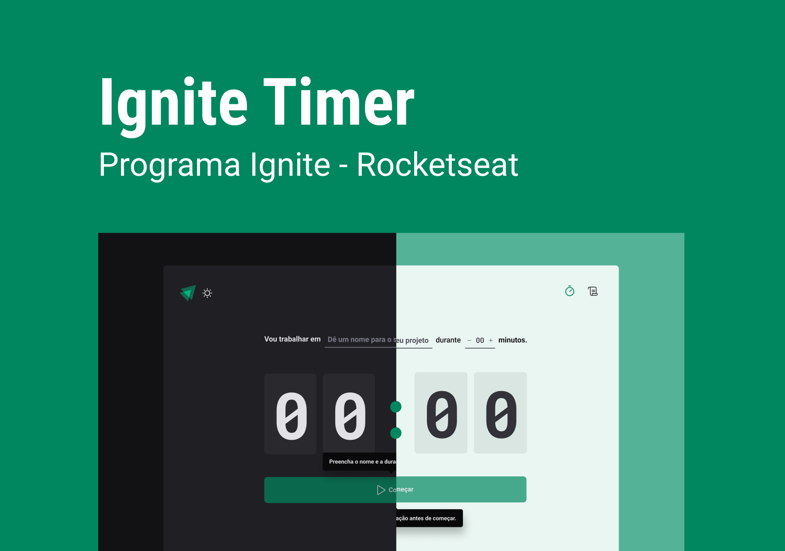

<p align="center" style="display:flex;justify-content:center;align-items:center;gap:10px;"> 
  
  Ignite Timer
</p>

<p align="center">
  
  
  
  
</p>

<br>

<h1 align="left"> 
  Ignite Timer application
</h1>
<p align="left"> 
  🚀 Manage time spent on your projects.
</p>

## Indexes

- [About](#About)
- [Technologies](#Technologies)
- [How to install and use](#How-to-install-and-use)

## About

<p>
  Ignite Timer is an application similar to Pomodoro that counts the time spent on a specific task or project. It can help you focus on your activities with a simple and friendly interface.
</p>

Application link: [https://ignite-timer-application.vercel.app/](https://ignite-timer-application.vercel.app/)

<p align="center">
  
</p>

## Technologies

- [Vite](https://vitejs.dev/)
- [React](https://pt-br.reactjs.org/)
- [TypeScript](https://www.typescriptlang.org/)
- [React Hook Form](https://react-hook-form.com/)
- [Zod](https://zod.dev/)
- [styled-components](https://styled-components.com/)

## How to install and use

Before you begin, you will need to have the following tools installed on your machine: [Git](https://git-scm.com), [Node.js](https://nodejs.org/en/).

In addition, it is good to have an editor to work with the code as [VSCode](https://code.visualstudio.com/).

```bash

# Clone this repository
$ git clone https://github.com/ewertonbn/ignite-timer

# Access the project folder in the cmd/terminal
$ cd ignite-timer

# Install the dependencies using npm or yarn
$ npm install

# Run the application in development mode
$ npm run dev

# The server will start at port:3000 - access  http://localhost:3000/

```

## License

This project is under the MIT license. See the [LICENSE](LICENSE.md) file for more details.

### Author

---

<a href="https://app.rocketseat.com.br/me/ewertonbn">
 
 <br />
 <sub><b>Ewerton Bernardo</b></sub></a> <a href="https://app.rocketseat.com.br/me/ewertonbn/" title="Rocketseat">🚀</a>

Made with ❤️ by Ewerton Bernardo 👋🏽 Let's connect!

[](https://www.linkedin.com/in/ewertonbn/)
[](mailto:ewerttonbn@gmail.com)
